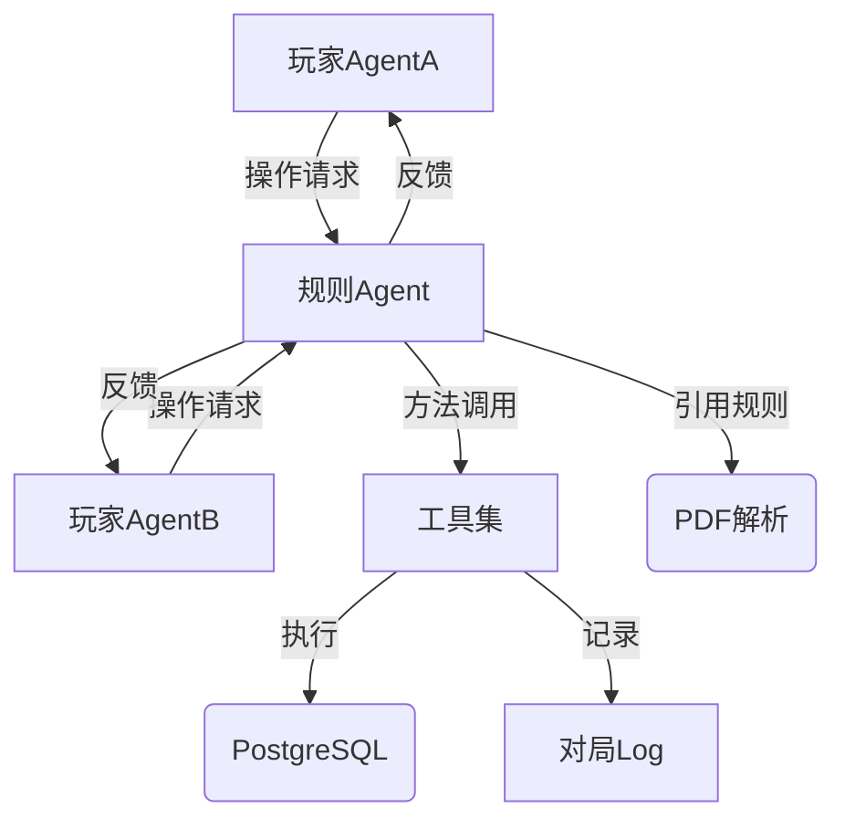
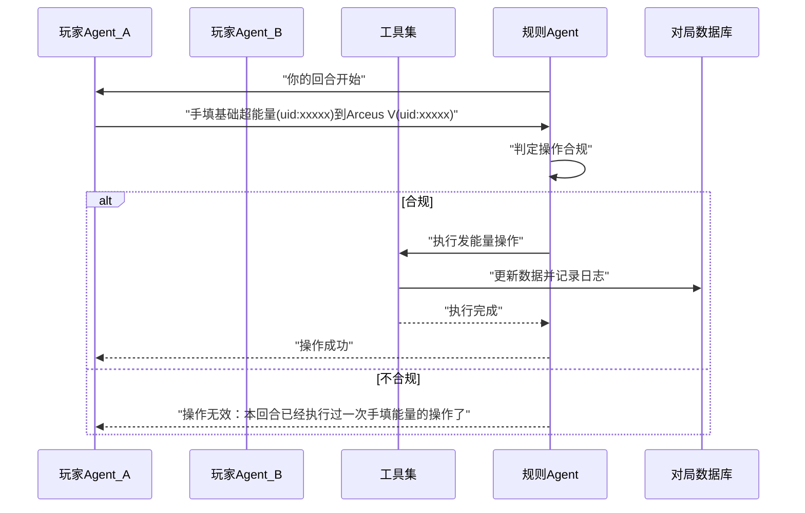

# AI 对战与 AI 裁判系统需求文档（PTCG）

## 一、项目概述

本项目旨在构建一个可实现 **AI 对战与 AI 裁判机制** 的 PTCG（宝可梦集换式卡牌游戏）模拟系统。
所有对战数据均记录在 PostgreSQL 数据库中，规则书（PDF 格式）作为规则知识库使用。系统由多个智能体（Agents）协同运行，通过严格遵守游戏规则，实现真实、公正、可复盘的对战过程。  
> ⚠️ 构建对战时，需保证每个牌组正好 60 张卡，且为每张卡分配唯一 `uid`（如 `playerA-deck-001`），用于后续的合法性判定、能力指向、日志追踪与复盘。

---

## 二、系统整体架构

### 架构总览



---

## 三、系统角色定义

| 角色                         | 职责说明                                       |
| -------------------------- | ------------------------------------------ |
| **规则Agent（Referee Agent）** | 扮演裁判，控制游戏流程，判断玩家行为是否合法；根据规则调用工具集操作。        |
| **工具集（Game Tools）**        | 提供所有游戏操作接口（初始化、洗牌、发牌、判定、记录等）；仅可被规则Agent调用。 |
| **玩家Agent（Player Agent）**  | 拟人化玩家智能体；只能通过规则Agent提出操作申请，不能直接修改游戏数据。     |
| **数据库层（Game DB）**          | 存储卡牌数据、对局记录、日志、玩家记忆等。                      |
| **规则知识库（Rules KB）**        | 从官方规则PDF及 PostgreSQL 中的卡牌表（`ptcg.ptcg_cards`）提取信息，供裁判Agent推理使用。 |

> ⚙️ 所有 Agent 基于 **LangChain Agents** 实现，统一调度接口、状态管理与消息格式，支持多模型后端（OpenAI、Anthropic、智谱AI GLM-4.6、通义千问等），便于后续扩展与上线部署。

---

## 四、模块划分

### 1. 工具集（Game Tools）

> 仅能由规则Agent调用，具有严格的权限控制。

> 🔐 **安全约束**：Game Tools 仅接受通过 Referee Agent 发起的调用，请求必须携带双向认证信息（首选 mTLS + 短期签名 Token）。玩家Agent 不具备调用凭证；任何直接访问均被拒绝并记录在安全日志内。

| 功能模块举例         | 功能说明                      |
| ------------ | ------------------------- |
| 对局初始化        | 创建新的对战实例，初始化双方牌库与状态。      |
| 洗牌           | 按随机算法重排牌库。                |
| 发牌           | 分发起手牌。                    |
| 获取奖赏卡        | 随机分配奖赏区的卡牌。               |
| 伤害记录         | 记录并更新 Pokémon 受伤状态。       |
| Knock Out 判定 | 根据伤害量和 HP 判定宝可梦是否被击倒。     |
| 输赢判定         | 根据剩余奖赏卡数量、手牌情况、回合状态等判断胜负。 |
| 查看牌库/弃牌区     | 提供数据读取接口。            |
| Log 记录       | 自动记录所有合法操作、状态变更、系统事件。     |

#### 1.1 工具集功能模块规划（以「喷火龙 ex / 波波鸽」卡组为用例）

> 工具集仅提供**最底层原子操作**，负责对状态与数据的可靠读写；所有“是否可执行”“执行顺序”“玩家确认”等流程均由规则Agent（AI 裁判） orchestration。

- **牌库查询原语**  
  - `DeckQuery(filters)`：按名称、HP、阶段、是否有规则框、属性等条件筛选卡牌，并支持结果分页/随机抽样。该原语既可满足 Pidgey「Call for Family」，也能支撑 Miraidon ex「Tandem Unit」一次找到两只基础雷宝可梦（`doc/cards/en/sv3pt5.json:949`、`doc/cards/en/sv4pt5.json:13800`）。  
  - `RevealTop(count)`、`SearchAny()` 仅揭示候选卡 ID，不执行移动或洗牌；规则Agent据此判断是否合法，例如 Electric Generator 只能查看顶 5 张牌（`doc/cards/en/sv4pt5.json:4636`）。

- **卡牌选择与确认原语**  
  - `SelectFromCandidates(ids, max_n)`：在查询结果中选择若干卡牌；若需玩家确认，由规则Agent在交互层完成，工具集只接收最终选择。  
  - `AutoSelect(strategy)`：用于 Quick Search、Infernal Reign 等“从牌库直接搜”场景，支持随机/确定策略（`doc/cards/en/sv3.json:9937`、`doc/cards/en/sv3.json:7503`）。

- **区域迁移原语**  
  - `MoveCard(source_zone, target_zone, card_id, position_hint)`：统一处理卡牌在牌库、手牌、备战区、主动区、弃牌、Lost Zone、奖赏区之间的迁移。  
  - 支持批量搬运（如 Super Rod 将 3 张牌洗回牌库，`doc/cards/en/sv2.json:10611`）与附带信息（例如放置到备战区时指定空槽）。是否满足 Collapsed Stadium 等限制由规则Agent预先校验。  
  - `SwapActiveWithBench(target_id, heal_hint)` 用于实现 Switch、Switch Cart、Escape Rope 等效果，可在交换后附带治疗值或强迫对手优先交换（`doc/cards/en/sv3pt5.json:12040`、`doc/cards/en/swsh10.json:8821`、`doc/cards/en/sm3.json:7321`）。

- **洗牌 / 局部揭示 / 随机附能原语**  
  - `Shuffle(zone)`、`RandomizePrize()` 等函数仅负责随机性与日志记录，确保调用可复现，用于满足 Call for Family、Quick Search、Forest Seal Stone 搜索后的“洗牌”要求（`doc/cards/en/swsh12.json:9398`）。  
  - `RevealTopPartial(count)`、`AttachEnergyFromReveal(targets)` 等组合操作支持 Electric Generator 这种“查看顶 X 张，抽取命中的能量并附着”的需求，剩余卡自动洗回（`doc/cards/en/sv4pt5.json:4636`）。  
  - 规则Agent在调用前后负责声明随机来源与可验证性；工具集需为每一次随机操作生成独立的 128-bit 随机种子（来源于操作系统的 CSPRNG，例如 `/dev/urandom` 或 `secrets.token_bytes()`），并把种子随调用参数一并写入 `match_logs.random_seed` 字段，便于复盘时重放随机序列。

- **能量与附着原语**  
  - `AttachEnergy(card_id, target_id, slot)`、`DetachEnergy(...)` 负责把具体能量卡与宝可梦绑定/解绑，支持 Lightning 能量从不同来源附着到任意雷宝可梦（如 Electric Generator、Flaaffy、Squawkabilly ex 的技能，`doc/cards/en/sv4pt5.json:4636`、`doc/cards/en/swshp.json:7554`、`doc/cards/en/sv4pt5.json:12904`）。  
  - `RecordAttachment(source)` 标记能量来源（手动附能、能力附能、技能附能），供规则Agent判断是否违反“一回合一次”限制（如 Charizard ex、Raichu V 首回合「Fast Charge」，`doc/cards/en/sv3.json:7503`、`doc/cards/en/swsh9.json:2683`）。  
  - 支持特殊能量与未来工具的属性变更：如 Double Turbo Energy 减伤、Future Booster Energy Capsule 影响未来种宝可梦的撤退与伤害；Temple of Sinnoh 等效果仍由规则Agent控制，工具集只提供能量及工具属性的读写接口（`doc/cards/en/swsh10.json:11683`、`doc/cards/en/sv5.json:8828`）。

- **状态计数与标记原语**  
  - `UpdateDamage(pokemon_id, delta)`、`SetSpecialCondition(...)`：纯粹的数值修改，供规则Agent在结算攻击或能力时调用。  
  - `TrackUsage(entity_id, counter_type)`：记录一次性或每回合限制（如 Rotom V「Instant Charge」用后立即标记回合结束，`doc/cards/en/swsh12pt5.json:2682`；Pidgeot ex「Quick Search」全局一次，`doc/cards/en/sv3.json:9937`；Squawkabilly ex「Squawk and Seize」仅首回合可用，`doc/cards/en/sv4pt5.json:12904`；Raikou V「Fleet-Footed」需要主动位限制，`doc/cards/en/swsh9.json:2874`）。  
  - `CheckKO(pokemon_id)`：工具集判断 HP≤0 并返回布尔结果，是否触发 Prize、Vengeful Punch、Iron Hands ex 额外奖赏等后续动作由规则Agent控制（`doc/cards/en/sv3.json:11569`、`doc/cards/en/sv4.json:12738`）。

- **区域快照与日志原语**  
  - `Snapshot(zone)`：只读接口，供规则Agent在响应玩家查询（如 Mew「Mysterious Tail」看 6 张牌，`doc/cards/en/cel25.json:624`）时调用，确保信息泄漏受控。  
  - `AppendLog(event)`：持久化记录，包括随机种子、调用参数、受影响卡牌，方便复盘。

- **奖赏与 Lost Zone 原语**  
  - `RevealPrize(count)`、`TakePrize(player_id)`、`ModifyPrizeDelta(delta)`、`SendToLostZone(card_id)` 等函数，分别处理 Prize 区与 Lost Zone 的读写，包含 Iron Hands ex「Amp You Very Much」额外奖赏的增量结算（`doc/cards/en/sv4.json:12738`）。  
  - Counter Catcher、Charizard ex 等需要 Prize 数量的数据可通过 `QueryZoneMeta(zone)` 获取实时统计（`doc/cards/en/sv4.json:9637`、`doc/cards/en/sv3.json:7527`）。  
  - Rotom V、Lost Vacuum 造成的放逐只是“移动到 Lost Zone”的一次原子调用，是否满足前置（如额外弃牌）由规则Agent保证（`doc/cards/en/swsh12pt5.json:2682`、`doc/cards/en/swsh11.json:9539`、`doc/cards/en/swsh12pt5.json:7823`）。

- **手牌置换与抽牌原语**  
  - `DiscardHand(player_id, reason)`、`Draw(player_id, count)`、`ShuffleHandIntoDeck(player_id)` 等函数用于执行 Professor's Research、Judge、Iono、Squawkabilly ex 等大量换手效果（`doc/cards/en/sv4pt5.json:4861`、`doc/cards/en/sv4pt5.json:13181`、`doc/cards/en/sv4pt5.json:13529`、`doc/cards/en/sv4pt5.json:12904`）。  
  - `RevealHand(player_id)`、`RandomDiscard(count)` 等辅助原语配合 Arven、Boss's Orders、Escape Rope 等需要玩家确认的效果，由规则Agent负责互动流程。  
  - 这些原语仅负责手牌/牌库的安全读写及日志记录，不参与合法性判断（例如是否已打出 Supporter 由规则Agent追踪）。

借助上述原语，规则Agent可以编排出“查询牌库 → 选择卡牌 → 放置备战区 → 洗牌”这类步骤来复现任何技能/训练家效果；工具集则专注于安全、可追踪、无副作用的底层操作。

---

### 2. 规则Agent（Referee Agent）

> 系统唯一的裁判角色，管理对战流程和操作合规性。

职责包括：

1. 维护当前游戏状态（回合、阶段、活跃宝可梦等）。
2. 根据规则知识库判定玩家申请是否合法。
3. 调用工具集执行合法操作。
4. 反馈执行结果与理由（成功/失败/违规说明）。
5. 根据游戏规则判断是否触发特殊事件（如特性、道具效果、异常状态等）。
6. 维护一份对局历史（Log），可用于 AI 训练和复盘。
7. 保留人工干预入口：系统支持“人工确认模式”与“自动判定模式”两种策略。上线初期及新增规则阶段，规则Agent在每一步判定后都需等待管理员确认后才可继续，以累积判例库；当某类判定的样本数量满足预设阈值（例如 100 次准确案例）并通过复核后，才可逐步切换为自动判定，若自动模式再次出现争议，则自动回退至人工确认模式。

---

### 3. 玩家Agent（Player Agent）

> 模拟人类玩家行为的智能体，具备决策与记忆能力。

职责包括：

* 分析当前场面信息与对局Log。
* 决定下一步操作（如使用卡牌、攻击、结束回合等）。
* 通过自然语言向规则Agent提出请求（例如："我想将手牌中的基础超能量(uid:xxxxx)附到Arceus V(uid:xxxxx)上"）。
* 接收规则Agent返回的结果（成功/失败/提示信息）。
* 在记忆模块中保存自己的策略演变、对手行为观察结果，以及每个回合的思考摘要，方便后续回合复盘与策略调整。

---

## 五、交互规范示例



---

## 六、权限控制逻辑

| 操作类型         | 玩家是否可直接申请 | 是否需规则判定 | 示例                          |
| ------------ | --------- | ------- | --------------------------- |
| 查看弃牌区        | ✅         | ✅       | 玩家提出申请 → 规则Agent判断是否合法后返回数据 |
| 查看牌库（完整）     | ❌         | ✅       | 仅特定卡牌效果（如巢穴球）触发时可申请         |
| 查看牌库上方若干张    | ❌         | ✅       | 使用特定卡牌（如超级球）时触发             |
| 修改数据（如攻击、附能） | ❌         | ✅       | 仅通过规则Agent验证后执行             |

---

## 七、数据库结构（简化示例，实际开发需要重新设计）

```sql
-- 对局记录表
CREATE TABLE matches (
    id SERIAL PRIMARY KEY,
    player_a TEXT,
    player_b TEXT,
    status TEXT,
    start_time TIMESTAMP,
    end_time TIMESTAMP
);

-- 日志表
CREATE TABLE match_logs (
    id SERIAL PRIMARY KEY,
    match_id INT REFERENCES matches(id),
    actor TEXT,
    action JSONB,
    result TEXT,
    random_seed BYTEA,
    timestamp TIMESTAMP
);
```

---

## 八、知识库规则处理

* 使用 PDF 解析（如 `pdfminer` 或 `PyMuPDF`）提取规则条目，并将结构化结果存入规则库索引。
* 卡牌信息直接来自 PostgreSQL `ptcg` 数据库下的 `ptcg_cards` 表，Rule KB 服务通过只读连接获取卡牌文本、数值、合法性等字段，与规则条目一起供 Referee Agent 检索。
* 通过向量化与语义检索模型（local RAG）实现规则与卡牌信息的快速匹配，并输出命中来源（规则书页码或 `ptcg_cards` 主键）。
* 规则Agent在执行前调用知识库，确认规则条款，例如：

  > “根据规则第 6.1.2 条，攻击时若目标拥有V防守能量，应减伤30点。”

* Postgres连接配置：
    ```
    PGHOST=localhost
    PGPORT=5432
    PGUSER=postgres
    PGPASSWORD=postgres
    ```
    - cards数据在ptcg_cards表中，可通过data_back_up文件夹中的ptcg_backup.sql文件快速配置好数据库
    - 补充包数据在ptcg_sets表中


---

## 九、AI 训练与记忆机制

* 玩家Agent具备自适应记忆模块，用于：

  * 记录每次操作、决策、结果。
  * 学习对手策略倾向。
  * 总结对战后的行为经验，用于下一次决策优化。
* 规则Agent的记忆用于：

  * 识别常见违规模式。
  * 优化判定逻辑。

> **记忆技术栈**：所有 Agent 记忆统一存入 PostgreSQL，结合 `pgvector` 扩展或向量服务（如 Qdrant）保存嵌入，并通过定期 Summarizer（基于多种嵌入模型 + 自回归模型，如 OpenAI Embeddings、智谱AI Embeddings 等）压缩历史，维持“短期缓存（最近 N 条原始事件）+ 长期摘要（向量检索）”的混合架构；工具集提供 `MemoryStore` API，允许 Agent 以 `uid`、时间戳、语义标签写入/查询记忆。

  * **嵌入生成**：默认调用 `text-embedding-3-large`（或开源等价模型）对每条记忆事件构建 3072 维向量；向量连同 `uid`、事件类型、发生回合、权重写入 `memory_embeddings` 表。为降低成本，可根据事件类型降采样（例如日志类每 3 条生成一次嵌入）。
  * **历史压缩（Summarizer）**：每局或每 10 条事件触发一次压缩任务，流程为：
    1. 读取该 Agent 最近 10~20 条原始事件。
    2. 使用多种 LLM 模型（如 OpenAI GPT-4、Anthropic Claude、智谱AI GLM-4.6 等），按模板生成 structured summary（包含意图、情绪、关键行动、依赖关系），并打分确定“可遗忘度”。
    3. 将摘要再次生成嵌入并写入 `memory_embeddings`，原始事件标记为 `archived=true`，但仍可在需要时回溯。
  * **检索策略**：基于 pgvector 的 `cosine_distance` 执行 top-k 检索（默认 k=5），并设定阈值 `distance <= 0.35` 作为命中标准；若无结果命中，则退化到最近 N 条事件。示例 SQL：

    ```sql
    SELECT uid, content, metadata
    FROM memory_embeddings
    WHERE agent_id = :agent
    ORDER BY embedding <#> :query_vector
    LIMIT 5;
    ```

    若结果的最小距离 > 0.35，则返回“无高相关记忆”，并提示 Agent 依靠短期缓存。查询向量由当前上下文拼接（如“对手前一回合的战斗策略 + 当前手牌”）后生成。

---

## 十、工程结构规划

> 工程采用模块化单仓（monorepo）形式，遵循“Agent（LangChain Agents）/工具集服务/数据库/知识库/基础设施”五大层划分，方便在 CI/CD 中做分阶段部署。

```
ptcg_agents/
├── agents/                    # 基于 LangChain Agents 的智能体实现
│   ├── referee/               # 裁判Agent（流程控制、判定 orchestration、人工确认模式）
│   └── players/               # 各类玩家Agent策略包（可多策略并行训练）
├── services/
│   ├── game_tools/            # 工具集原子接口实现（Python 微服务，提供 gRPC/HTTP API）
│   ├── state_sync/            # 与 PostgreSQL 交互的状态读写层，封装事务 & 乐观锁
│   └── rule_kb/               # 规则知识库微服务，负责 PDF 解析、向量检索与命中解释
├── apps/
│   ├── simulator_api/         # 对外提供对战创建、查询、回放等 REST 接口
│   └── admin_console/         # 管理后台（人工确认入口、对局监控、判例管理）
├── data/
│   ├── cards/                 # 卡牌 JSON 元数据
│   ├── sets/                  # 补充包元数据
│   └── rulebooks/             # 官方规则 PDF、解析后的结构化结果
├── db/
│   ├── migrations/            # SQL/ORM 迁移脚本
│   └── seeds/                 # 初始数据（示例卡池、演示对局）
├── infra/
│   ├── docker/                # 服务容器化配置（Dockerfile、docker-compose、K8s manifests）
│   └── terraform/             # 云上基础设施定义（如数据库、对象存储、日志服务）
├── tests/
│   ├── integration/           # Agent + 工具集联调用例
│   └── e2e/                   # 端到端对战回放校验
├── scripts/                   # 运维/数据校验脚本（自动分配卡牌 uid、日志清洗等）
└── docs/                      # 需求、设计、API 规范（含本文件）
```

### 关键约束

1. **Agent 层**：统一使用 LangChain Agents；支持多模型后端（OpenAI、Anthropic、智谱AI GLM-4.6、通义千问等），可通过配置灵活切换；Referee Agent 提供 Webhook/CLI 入口，玩家Agent以策略插件形式注册，允许在训练环境与线上环境复用。
2. **服务层**：Game Tools、State Sync、Rule KB 均以独立微服务暴露 API，Referee Agent 通过服务网关调用，确保权限可控、易于水平扩展。
3. **数据层**：PostgreSQL 作为单一事实来源；State Sync 负责事务封装，并将关键状态变化写入 `match_logs`，同时将卡牌 `uid` 与操作参数打包。
4. **管理与监控**：Admin Console 必须对接人工确认模式，提供“逐步放开”配置、判例库浏览、告警推送；同时集成日志/指标上报（如 Prometheus + Grafana）。
5. **CI/CD 流程**：引入多阶段流水线（lint → 单测 → 集成测 → e2e → 部署），其中工具集与 Agents 需提供模拟器以跑自动化脚本；数据目录变更需触发卡牌校验脚本（检查 60 张卡与 `uid` 唯一性）。

通过上述工程结构，可将需求文档中的功能拆解到具体子项目，保证 Agent、工具集、数据库、知识库之间的职责清晰、易于扩展与维护。

---

## 十一、技术栈选择

> 原则：**优先使用 Python 3.11+ 实现所有后端模块**，仅在性能瓶颈或现有组件难以复用时，引入 Node.js/Go/Rust 等补充技术。下表中的“技术模块”与第四章的业务模块一一对应：
> * Agents 层 ↔ 第四章中的“规则Agent / 玩家Agent”
> * Game Tools / State Sync / Rule KB ↔ “工具集”细分出来的执行层与数据同步层
> * Simulator API / Admin Console ↔ “交互规范、权限控制”中提到的系统入口与人工干预界面
> * Data 处理 ↔ “知识库规则处理”与“AI 训练”所需的数据更新任务
> * DB & 缓存、Infra & CI/CD、测试框架 ↔ 为上述业务模块提供的基础设施支撑

| 模块 | 主要技术 | 说明 |
| --- | --- | --- |
| **Agents 层（Referee / Players）** | Python 3.11、LangChain Agents、LangChain OpenAI/Anthropic/Community、FastAPI / Starlette、Redis Stream | 统一使用 Python 实现裁判与玩家策略，借助 LangChain Agents 完成任务编排，支持多模型后端（OpenAI、Anthropic、智谱AI GLM-4.6、通义千问等）；FastAPI/Starlette 提供 Webhook；Redis Stream 负责短期事件排队。 |
| **Game Tools 服务** | Python 3.11、FastAPI + gRPC（grpcio）、asyncio + uvloop、SQLAlchemy Core / asyncpg、Kafka | 通过 Python 异步栈实现高并发原子操作；如局部性能瓶颈可用 Rust/Python FFI。gRPC 接口供 Referee Agent 调用，同时将事件推送到 Kafka。 |
| **State Sync 层** | Python 3.11、SQLAlchemy、PostgreSQL 15、pgvector | 封装数据库事务与一致性写入 match_state / match_logs；pgvector 存储记忆嵌入。 |
| **Rule KB 服务** | Python 3.11、FastAPI、PyMuPDF、LangChain、Qdrant | 负责解析规则 PDF、读取 `ptcg_cards` 表并构建语义检索服务。 |
| **Simulator API** | FastAPI、GraphQL（Strawberry，可选）、OAuth2 | 对外暴露对战管理接口，复用 State Sync 的数据访问。 |
| **Admin Console** | Next.js 14、TypeScript、Chakra UI、Auth0 | 前端界面仍采用 Next.js；后端 API 由 Python 服务提供。 |
| **Data 处理** | Python、Pandas、Prefect/ Airflow | 统一用 Python 管理 ETL、卡牌 JSON 更新、规则解析任务。 |
| **DB & 缓存** | PostgreSQL 15、Redis 7、pgvector 扩展 | PostgreSQL 为主库；Redis 提供短期缓存与记忆临时存储。 |
| **Infra & CI/CD** | Docker、Kubernetes、Helm、Terraform、GitHub Actions | 统一容器化部署方案；GitHub Actions 负责流水线。 |
| **测试框架** | pytest、Playwright、k6 | 后端以 pytest/pytest-asyncio 为主；前端与端到端测试用 Playwright；性能测试依旧使用 k6。 |

> 所有服务遵守统一 observability 规范：OpenTelemetry（OTel）采集指标/日志并上报至 Prometheus + Grafana，便于跨模块追踪。
